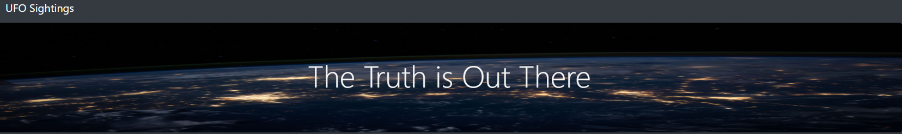
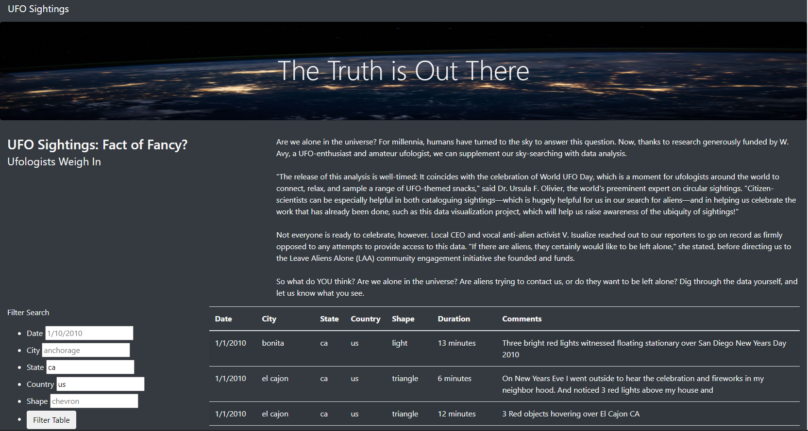

## Summary
The purpose of this project was to create a website where Dana's recent articale on UFO's could be displayed along with some supporting information. This presents a very accessibile way to read her material and also sort through the large dataset of sightings.

## Technoligies used
Primarily HTML/CSS/Javascript.
- HTML was used to create website framing and setup various webpage elements such as the search bxoes. CSS & Bootstrap used to add additional styling
- Javascript to import and filter the data for display by the html

## Further development
- The ability for users to submit requests to log a new sighting
- Updating the news section to automocally scroll through different excerts
- The addition of a recommeded videos frame
- Links to the author's contact information and profile page
- Refactor the updateFilters() function to use a loop and be able to accomodate a dynamic number of total filters
- Add a "clear filter" button to reset the table

